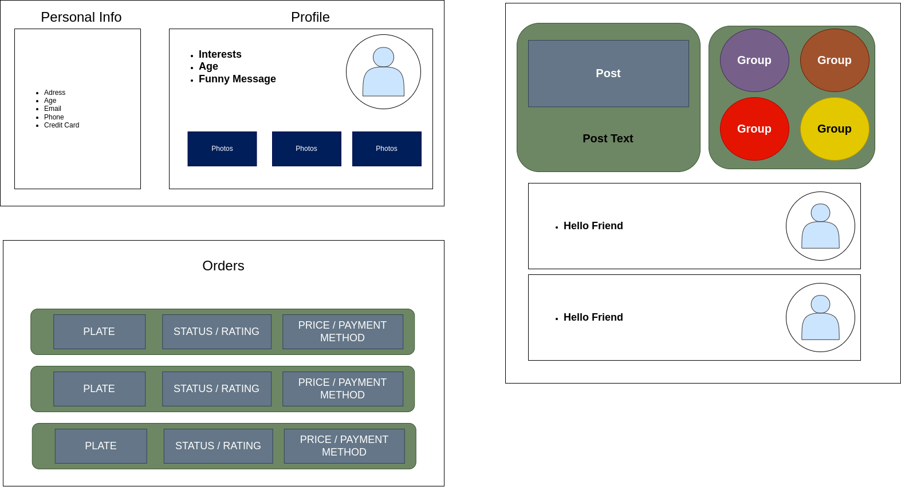

# Introduction

My website idea is a franchisible restaurant / delivery / marketplace for vegan food. Crocanos. The name comes from the portuguese word "croncante" (crunchy).
Our goal is to make people enjoy vegan food as very practical and delicious service, while being able to prepare their own delicious meals at the confort of home.

## Expected List of Features

The needed features for the website are:

* Menus
    * Order menu: 
        * Local menu: to order locally on each restaurant.
        * Fast menu: to order fast food plates to go.
    * Delivery Menu: to order remotly in home.
* Free Market    
    * Marketplace: where you could order pre-maid ingridients to make your own plates from the fast menu.
    * Carbon credit Buying: an space where the service will actuall sell carbon credit.
    * Carbon credit selling: an space where the service will actuall sell carbon credit.
* Social:
    * User space: an space where the user will be able to check it's current order and manage other personal informations, like address and credit cards. Here, the user could subscribe as a deliver person as well, after passing through some tests and crontract.
    * Vegan network: an space where each used could share their experience with the website, sharing photos and posts, and also invinting others for events.

# User Interface Design and Prototype

## Login

## Menus

## Social

## Free Market

# Navigation Structure

The user will be able to navigate through the menus like 

# References

https://www.industry.gov.au/sites/default/files/open_government_partnership_committment_5.2_prototype_report.pdf